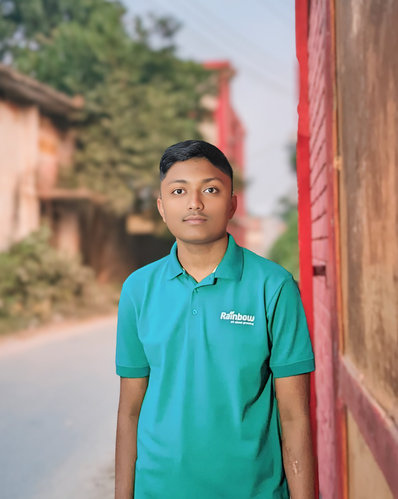

Here is a `README.md` file created with emojis and styled for your project based on the uploaded file:

```markdown
# 🌟 Abir Arafat Chawdhury's Portfolio Website 🌟

Welcome to the personal portfolio website of **Abir Arafat Chawdhury** – aka Abir360, a passionate **coder**, **modder**, and **freelancer**! 🚀

---

## 🏠 Website Overview

This website showcases:
- **Home Section** 🏡: A welcoming introduction to who I am.
- **About Me** 👨‍💻: Learn about my journey, experiences, and skills.
- **Projects** 💼: A collection of my past and ongoing works.
- **Contact** 📞: Get in touch with me!

---

## ✨ Features

- 🎨 **Responsive Design**: Adapts to all screen sizes.
- 🎭 **Dynamic Content**: Includes interactive elements.
- 🌐 **Social Links**: Connect with me on Instagram, Facebook, and YouTube.
- ⚡ **Preloader Animation**: A stylish loading animation.

---

## 🛠️ Technologies Used

- **HTML5** 🖋️
- **CSS3** 🎨
- **JavaScript** ⚙️
- **Bootstrap** 📦
- **FontAwesome Icons** ✨

---

## 📷 Preview



---

## 🚀 Getting Started

To set up and run the project locally:

1. Clone the repository:
   ```bash
   git clone https://github.com/AbirXDHackz/Portfolio.git
   ```

2. Navigate to the project folder:
   ```bash
   cd Portfolio
   ```

3. Open `index.html` in your browser.

---

## 🌐 Social Profiles

- **YouTube** 🎥: [Abir360](https://www.youtube.com/@abirxdhackz)
- **Instagram** 📸: [abirxdhackz](https://www.instagram.com/abirxdhackz)
- **Facebook** 📘: [abirxdhackz](https://www.facebook.com/abirxdhackz)

---

## 📬 Contact Me

Feel free to reach out via:

- **Email** ✉️: [abirthedigitalguru@gmail.com](mailto:abirthedigitalguru@gmail.com)
- **WhatsApp** 📱: +88 01963818285

---

© 2024 **Abir Arafat Chawdhury** | Designed by **AbirXDHackz**
``